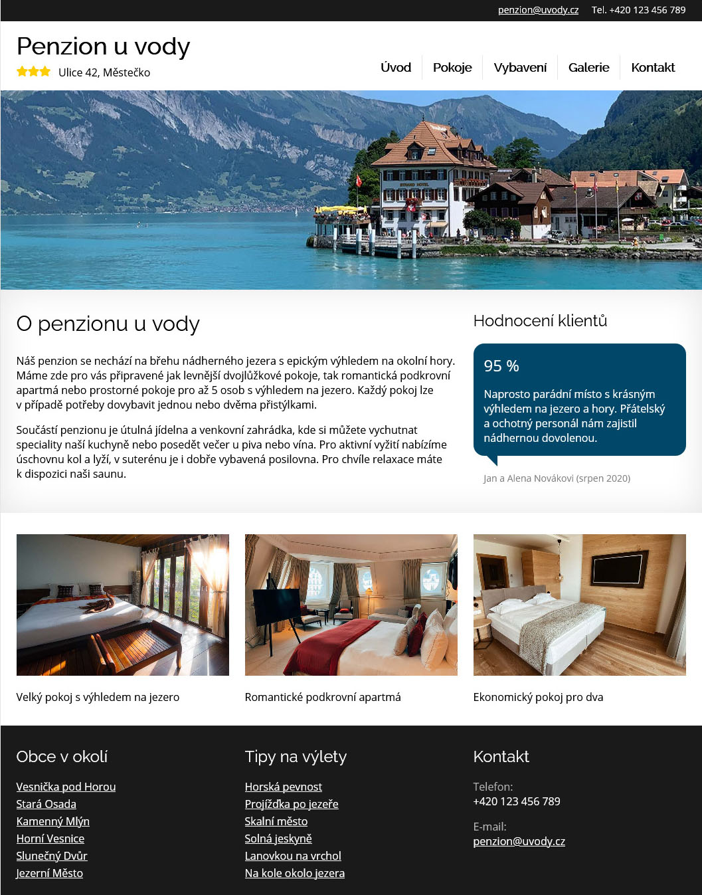

# Penzion u vody

Povinný úkol.

- [Cíl úkolu](#Cíl-úkolu)
- [Doplňující úkoly](#Doplňující-úkoly)
- [Jak si stáhnout podklady](#Jak-si-stáhnout-podklady)

Než začneš s projektem cokoliv dělat, přečti si prosím celý tento text až do konce.

Jako podklad dostáváš kompletně nakódovaný web o pěti stránkách. Tvým úkolem je udělat z něho Eleventy projekt, z částí stránky společných pro celý web udělat šablonu, ve stránkách samotných nechat pouze obsah a vše nastavit tak, aby výsledkem byl opět hotový a funkční web. Tento web pak vystav na Netlify.

## Cíl úkolu

Cílem tohoto úkolu je hlavně vyzkoušet si základní práci s generátorem statických webů Eleventy:
- **Práce s Eleventy**
  - součástí zadání je kompletně nakódovaný pětistránkový web (HTML, CSS, obrázky)
  - proveď v projektu `npm init` a nainstaluj Eleventy
  - nakonfiguruj Eleventy, můžeš použít žádné (defaultní) nastavení s doplněním vlastních požadavků dle potřeby, nebo že ji můžeš celou napsat (pak ale budeš mít jinde výstup a bude třeba upravit . gitignore), je třeba dát pozor na to, aby se do sestaveného webu kopírovaly složky `css` a `images`
  - v sekci `scripts` souboru *package.json* vytvoř dva skripty
  - spusť web lokálně pomocí skriptu a vyzkoušej, zda vše funguje správně
- **Vytvoření šablony**
  - všech pět stránek webu má společné záhlaví a zápatí
  - vytvoř ze společných částí šablonu
  - v HTML stránkách nech pouze obsah unikátní pro danou stránku
  - do stránek přidej **front matter** a nastav stránky tak, aby používaly vytvořenou šablonu
  - každá stránka musí mít svůj vlastní `title`
  - v HTML (v šabloně i v obsahu) a v CSS uprav cesty k obrázkům, stylům, apod. tak, aby začínaly lomítkem a ukazovaly na správné soubory
  - v šabloně uprav menu, aby ukazovalo na správné adresy stránek, až Eleventy vygeneruje výsledný web
- **Práce s Gitem**
  - ověř, že v souboru *.gitignore* ignorujeme složku *_site* a *node_modules*, protože ani jednu z nich v Gitu nechceme ukládat
  - prováděj pravidelné commity řešení na GitHub
- **Netlify**
  - pokud ještě nemáš, tak si vytvoř účet na [Netlify](https://netlify.com)
  - na Netlify si založ nový web
  - jako zdroj pro vytvořený web nastav svůj GitHub repozitář s tímto úkolem
  - pokud se na Netlify podaří web sestavit a publikovat, zkopíruj jeho adresu a vlož ji do popisu GitHub repozitáře, abychom mohli zkontrolovat, zda ti web na Netlify opravdu běží

## Doplňující úkoly

Pro oživení kódování HTML a CSS splň alespoň první z následujících úkolů:

- **Responzivní webdesign**
  - v CSS je nakódovaná pouze počítačová verze webu
  - vymysli, jak by mohla vypadat mobilní a tabletová verze a doplň je do CSS
  - nezapomeň, že používáme přístup **mobile first**, takže je pravděpodobné, že části již hotového CSS budeš muset trochu přeskládat
- **Kódování CSS**
  - pokud se opravdu nudíš nebo se ti design webu nelíbí, můžeš obsah CSS souboru kompletně vymazat a celý web si nákódovat od začátku sám/sama
- **BEM**
  - můžeš vymazat i obsah HTML souborů a nakódovat si i celou strukturu webu
  - odhodláš-li se k tomuto kroku, snaž se při kódování HTML držet metodiky BEM pro pojmenování tříd

## Jak si stáhnout podklady

1. Vytvořte si nový repozitář z template (tento repozitář)

